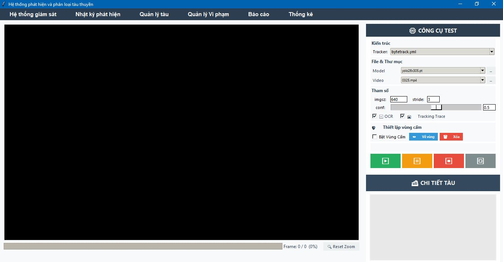
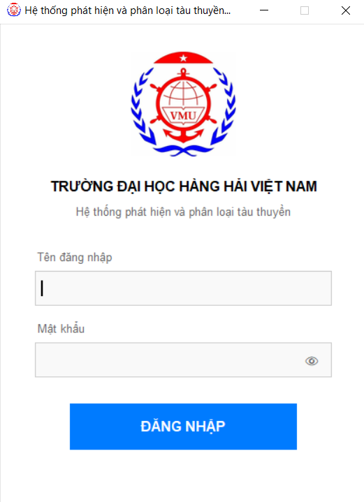
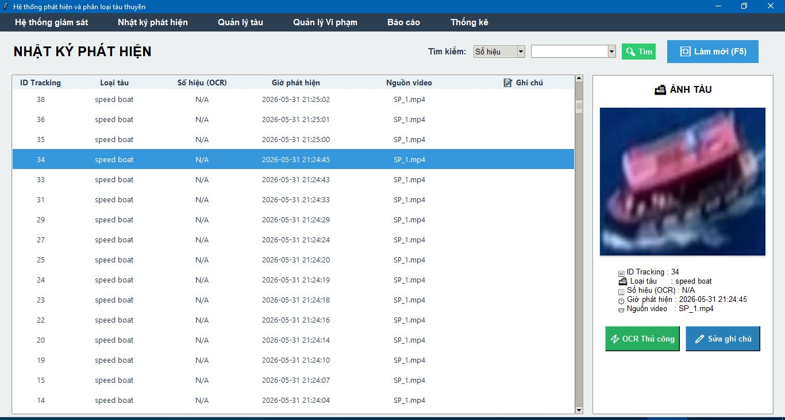
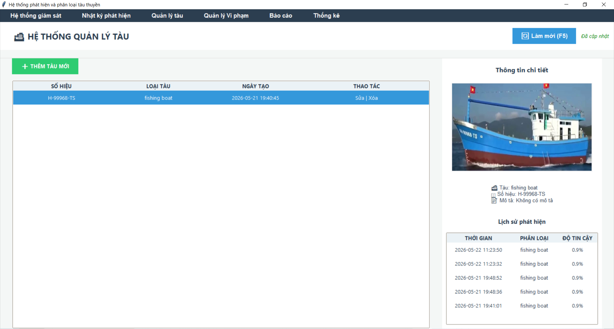
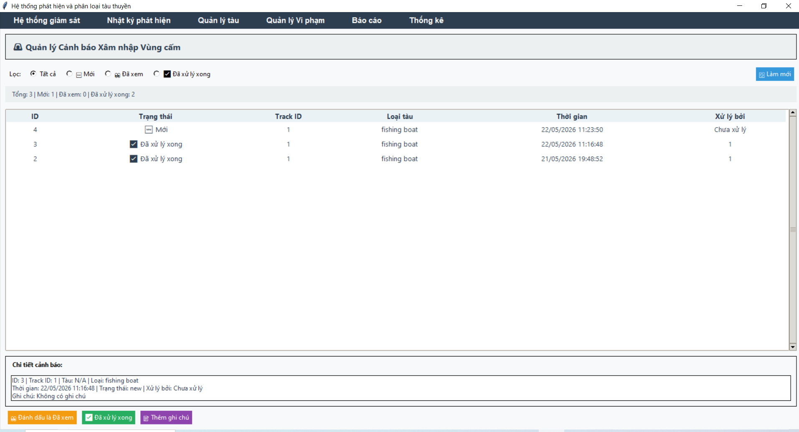
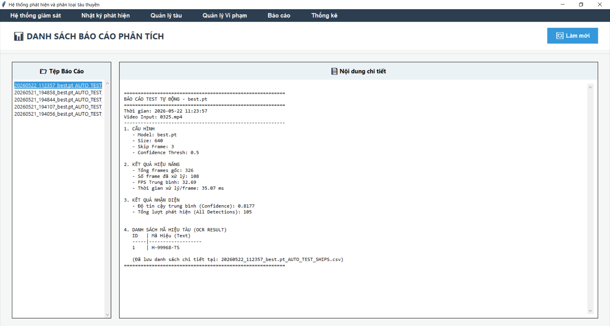
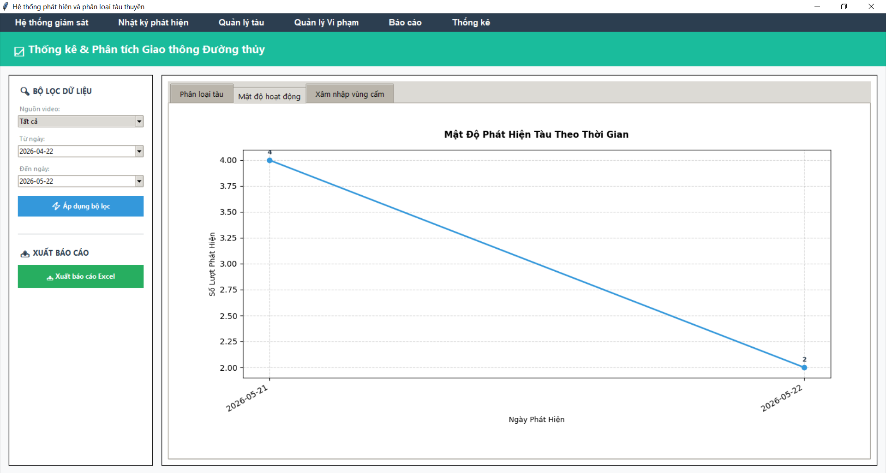

# Hệ Thống Phát Hiện Và Phân Loại Tàu Thuyền

<p align="center">
  Ứng dụng giám sát tàu thuyền bằng YOLO (tracking), OCR (PaddleOCR), quản lý nhật ký, cảnh báo vùng cấm và thống kê.
</p>

<p align="center">
  
</p>


# Tính năng chính

- Giao diện Tkinter trực quan
- Phát hiện tàu thời gian thực
- Theo dõi nhiều đối tượng
- OCR số hiệu tàu
- Quản lý dữ liệu SQL Server
- Nhật ký phát hiện
- Quản lý tàu
- Quản lý vi phạm
- Thống kê biểu đồ
- Xuất Excel báo cáo
- Build thành file `.exe`

---

# Hình ảnh giao diện

## Đăng nhập hệ thống

<p align="center">
  
</p>

---

## Giám sát và nhật ký

<table>
<tr>

<td align="center" width="50%">

<br>
<b>Hệ thống giám sát</b>
</td>

<td align="center" width="50%">

<br>
<b>Nhật ký phát hiện</b>
</td>

</tr>
</table>

---

## Quản lý dữ liệu

<table>
<tr>

<td align="center" width="50%">

<br>
<b>Quản lý tàu</b>
</td>

<td align="center" width="50%">

<br>
<b>Quản lý vi phạm</b>
</td>

</tr>
</table>

---

## Báo cáo và thống kê

<table>
<tr>

<td align="center" width="50%">

<br>
<b>Báo cáo</b>
</td>

<td align="center" width="50%">

<br>
<b>Thống kê</b>
</td>

</tr>
</table>


# Công nghệ sử dụng

| Thành phần | Công nghệ |
|---|---|
| AI Detection | YOLOv8 |
| Tracking | ByteTrack / BoTSORT |
| OCR | PaddleOCR |
| Giao diện | Tkinter |
| Database | SQL Server |
| Xử lý ảnh/video | OpenCV |
| Đóng gói | PyInstaller |
| Xuất Excel | OpenPyXL |
| Biểu đồ | Matplotlib |

---

# Cấu trúc dự án

```text
Ship_Detection_DoAn/
├── src/
│   ├── main.py
│   ├── controllers/
│   ├── views/
│   ├── engines/
│   │   ├── yolo_engine.py
│   │   └── ocr_engine.py
│   ├── utils/
│   ├── config/
│   └── trackers/
│
├── models/
├── videos/
├── outputs/
├── picture/
├── hooks/
│
├── build_exe.py
├── requirements.txt
└── README.md
```

---

# Chạy bằng Python (phát triển / demo)

## 1. Tạo môi trường

```powershell
cd D:\ThucTapDoAn\Ship_Detection_DoAn

py -3.11 -m venv venv311   

.\venv311\Scripts\Activate.ps1

python -m pip install --upgrade pip setuptools wheel
```

---

## 2. Cài PyTorch CUDA

```powershell
pip install torch torchvision torchaudio --index-url https://download.pytorch.org/whl/cu121
```

---

## 3. Cài thư viện

```powershell
pip install -r requirements.txt
```

---

## 4. Tạo cơ sở dữ liệu

- Cài SQL Server (`.\SQLEXPRESS`)
- Chạy file:

```text
src/database.sql
```

- Database:

```text
shipdb
```

- Tài khoản mặc định:

```text
admin / 1
```

---

## 5. Chạy chương trình

```powershell
.\venv311\Scripts\Activate.ps1

python src/main.py
```

---

# Đóng gói file exe

## Các thư mục liên quan

| Thư mục | Mô tả |
|---|---|
| hooks/ | Hook cho PyInstaller |
| build/ | File tạm khi build |
| dist/ | Bản phát hành |

---

## Cài PyInstaller

```powershell
pip install pyinstaller
```

---

## Build exe

```powershell
cd D:\ThucTapDoAn\Ship_Detection_DoAn

.\venv311\Scripts\Activate.ps1

python build_exe.py
```

---

## Sau khi build

Chạy file:

```text
dist\ShipDetection\ShipDetection.exe
```

---

## Cấu trúc bản phát hành

```text
dist\ShipDetection\
├── ShipDetection.exe
├── _internal\
├── models\
├── videos\
└── outputs\
```

---

## Copy sang máy khác

Copy toàn bộ:

```text
dist\ShipDetection\
```

---

## Yêu cầu máy đích

- Windows 10/11 64-bit
- Visual C++ Redistributable x64
- SQL Server
- NVIDIA Driver + CUDA

---

# Hướng dẫn sử dụng (giao diện)

## Bước 1

Đăng nhập:

```text
admin / 1
```

---

## Bước 2

Trong giao diện giám sát:

- Chọn model YOLO
- Chọn video
- Chọn tracker
- Thiết lập OCR
- Nhấn Bắt đầu

---

## Bước 3

Theo dõi kết quả:

- Bounding Box
- Tracking ID
- OCR số hiệu tàu
- Nhật ký phát hiện
- Vi phạm vùng cấm

---

## Các module chức năng

| Module | Chức năng |
|---|---|
| Giám sát | Detection + Tracking |
| Nhật ký | Lưu phát hiện |
| Quản lý tàu | CRUD dữ liệu tàu |
| Vi phạm | Cảnh báo vùng cấm |
| Báo cáo | Xuất Excel |
| Thống kê | Biểu đồ dữ liệu |

---

# Tham số gợi ý

## GPU yếu (RTX 1050 ~ 2GB)

| Tham số | Giá trị |
|---|---|
| Image Size | 416 hoặc 640 |
| Stride | 3–5 |
| Confidence | ≥ 0.7 |

# Yêu cầu hệ thống

| Thành phần | Yêu cầu |
|---|---|
| Python | 3.11+ |
| RAM | 8GB+ |
| GPU | NVIDIA CUDA |
| Disk | 10GB+ |

---

# Package chính

```text
ultralytics
torch
torchvision
opencv-python
paddleocr
paddlepaddle
pandas
pyodbc
matplotlib
openpyxl
tkcalendar
```

---

# Ghi chú

- `build/` có thể xóa bất cứ lúc nào
- `dist/` chứa file chạy chính
- `hooks/` cần giữ để build ổn định

---

# Cập nhật

```text
22/5/2026
```