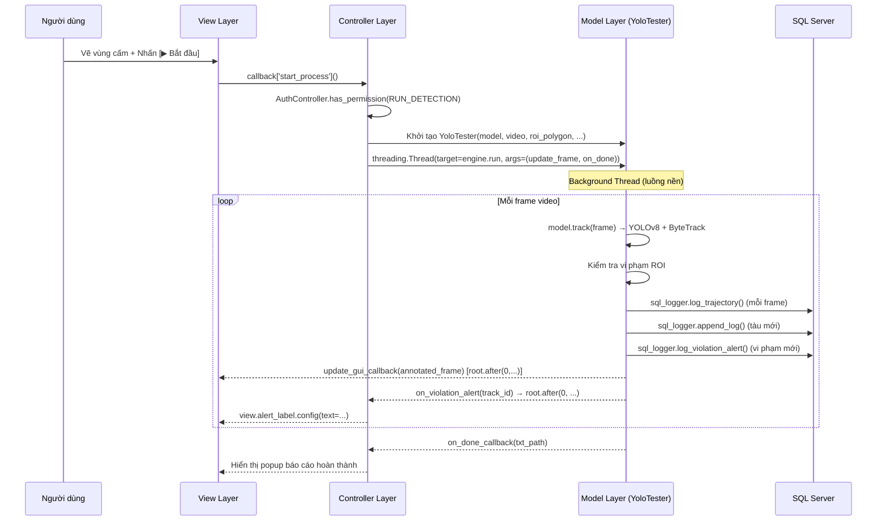

# 3.6.1 Kiến Trúc Phần Mềm – Mô Hình MVC Hệ Thống Phát Hiện Tàu Thuyền

> Tài liệu này mô tả chi tiết kiến trúc ba lớp MVC (Model – View – Controller) của hệ thống,
> được đối chiếu trực tiếp với mã nguồn thực tế trong thư mục `src/`.

---

## 3.6.1.1 Lớp Giao Diện (View Layer)

### Vai trò & Nguyên tắc thiết kế

Lớp Giao Diện chịu trách nhiệm **hiển thị giao diện đồ họa người dùng (GUI)** và **tiếp nhận các sự kiện tương tác** như click chuột, nhập liệu, chọn file. Lớp này được xây dựng bằng thư viện `tkinter` của Python.

> [!IMPORTANT]
> **Passive View Pattern**: View hoạt động hoàn toàn theo mô hình Passive View — **không chứa bất kỳ logic xử lý nghiệp vụ nào**, không kết nối trực tiếp đến cơ sở dữ liệu. Toàn bộ yêu cầu người dùng được chuyển tiếp tới Controller thông qua cơ chế **hàm gọi lại (callback)**.

### Cơ chế Callback

Thay vì View tự xử lý sự kiện, `MainController` truyền vào một từ điển `callbacks` chứa các hàm xử lý:

```python
# main_controller.py — khởi tạo callbacks trước khi tạo View
self.callbacks = {
    'choose_model':        self.choose_model,
    'choose_video':        self.choose_video,
    'start_process':       self.start_process,
    'stop_process':        self.stop_process,
    'toggle_pause':        self.toggle_pause,
    'reset_video':         self.reset_video,
    'on_canvas_click':     self.on_canvas_click,
    'on_closing':          self.on_closing,
    ...
}
self.view = MainView(self.root, self.callbacks)
```

View chỉ gắn callback vào widget, không tự xử lý:

```python
# main_view.py — gắn callback vào nút, KHÔNG tự xử lý
start_btn = tk.Button(..., command=self.callbacks['start_process'])
self.canvas_video.bind('<Button-1>', self.callbacks['on_canvas_click'])
```

---

### Các thành phần chính

#### 1. [`login_view.py`](file:///e:/Ship_Detection-do-an/src/views/login_view.py) — Giao diện đăng nhập

| Thuộc tính | Chi tiết |
|---|---|
| **Class** | `LoginView(tk.Toplevel)` |
| **Kích thước** | 420×550 px, không thay đổi kích thước |
| **Widgets chính** | Logo VMU, TextBox username/password, Button đăng nhập |
| **Callback ra ngoài** | `on_login_success(username, password)` |

**Cơ chế hoạt động:**
- Hiển thị logo từ `picture/logo.png`
- Khi nhấn nút "ĐĂNG NHẬP" hoặc phím `<Enter>`, gọi `handle_login()`:
  - Kiểm tra trường trống → hiện cảnh báo
  - Nếu hợp lệ → gọi `self.on_login_success(username, password)` ← đây là callback do `main.py` truyền vào
- **Không tự xác thực** — chỉ thu thập thông tin và chuyển lên tầng trên

```python
# login_view.py — chỉ thu thập, không xử lý nghiệp vụ
def handle_login(self):
    username = self.username_var.get().strip()
    password = self.password_var.get().strip()
    if not username or not password:
        messagebox.showwarning('Cảnh báo', '...')
        return
    if self.on_login_success:          # ← gọi callback từ bên ngoài
        self.on_login_success(username, password)
```

---

#### 2. [`main_view.py`](file:///e:/Ship_Detection-do-an/src/views/main_view.py) — Giao diện giám sát chính

| Thuộc tính | Chi tiết |
|---|---|
| **Class** | `MainView` (không kế thừa, nhận `root: tk.Tk`) |
| **Kích thước** | 1400×900 px |
| **Widgets chính** | NavBar, Canvas video, Panel điều khiển, Label cảnh báo, ProgressBar |

**Cấu trúc bố cục:**

```
root (tk.Tk, 1400×900)
├── NavBar (tk.Frame, bg=#2c3e50)          ← 6 nút điều hướng
└── Container (tk.Frame)
    ├── monitoring (tk.Frame)              ← trang giám sát chính
    │   ├── left_wrapper
    │   │   ├── canvas_video (tk.Canvas)   ← hiển thị frame video
    │   │   ├── progress_bar (ttk.Progressbar)
    │   │   └── alert_label (tk.Label)     ← cảnh báo vi phạm
    │   └── right_panel (width=380px)
    │       ├── control_frame              ← các tham số & nút điều khiển
    │       │   ├── Tracker ComboBox
    │       │   ├── Model/OCR/Video ComboBox
    │       │   ├── imgsz, stride, conf
    │       │   ├── ROI drawing controls
    │       │   └── [▶] [⏸] [⏹] [🔄] buttons
    │       └── detail_frame               ← chi tiết tàu được chọn
    │           ├── detail_canvas          ← ảnh crop tàu
    │           └── detail_text (tk.Label)
    ├── database (LogView frame)
    ├── ships (ShipView frame)
    ├── alerts (AlertsView frame)
    ├── reports (ReportView frame)
    └── statistics (StatisticsView frame)
```

**Tính năng đặc biệt của Canvas video:**
- **Zoom**: Con lăn chuột → `_on_zoom()` — zoom từ 1x đến 8x
- **Pan**: Giữ chuột giữa + kéo → `_pan_start_drag()` / `_pan_do_drag()`
- **Vẽ ROI**: Click chuột trái khi `drawing_roi=True` → thêm điểm vào `roi_original_points`
- **Chọn tàu**: Click vào bounding box → callback `on_canvas_click` → Controller xử lý

**Phương thức cập nhật giao diện từ luồng nền:**

```python
# main_view.py — nhận frame từ background thread, dùng root.after()
def update_frame(self, frame, fps):
    def task(frame_copy):
        # ... xử lý resize, zoom, vẽ ROI ...
        self.tk_img = ImageTk.PhotoImage(...)
        self.canvas_video.create_image(...)
    self.root.after(0, lambda: task(frame))  # ← thread-safe
```

> [!NOTE]
> `root.after(0, ...)` là cơ chế then chốt để cập nhật GUI từ background thread một cách thread-safe trong tkinter.

---

#### 3. [`ship_view.py`](file:///e:/Ship_Detection-do-an/src/views/ship_view.py) — Giao diện quản lý tàu

| Thuộc tính | Chi tiết |
|---|---|
| **Class** | `ShipView` |
| **Chức năng** | Hiển thị danh mục tàu, ảnh đại diện, lịch sử phát hiện |
| **Widgets chính** | TreeView danh sách tàu, Canvas ảnh, TreeView lịch sử |

- Hiển thị danh sách tàu trong `ship_tree` (TreeView với cột: Số hiệu, Loại tàu, Mô tả, Thao tác)
- Click cột "Thao tác" → context menu Sửa/Xóa (xử lý bởi `ShipController`)
- Không tự truy vấn CSDL — dữ liệu được đẩy vào từ `ship_controller.refresh_ship_list()`

---

#### 4. [`log_view.py`](file:///e:/Ship_Detection-do-an/src/views/log_view.py) — Giao diện nhật ký phát hiện

| Thuộc tính | Chi tiết |
|---|---|
| **Class** | `LogView` |
| **Chức năng** | Tra cứu, hiển thị, lọc lịch sử nhật ký phát hiện tàu |
| **Widgets chính** | ComboBox tìm kiếm, TreeView nhật ký, nút OCR thủ công, nút ghi chú |

- Hỗ trợ lọc theo **Số hiệu tàu** hoặc **Loại tàu** qua `search_type` ComboBox
- Chọn hàng trong TreeView → callback `on_tree_select` → hiển thị ảnh crop tàu và thông tin chi tiết
- Nút "OCR thủ công" → callback `manual_ocr` → `LogController` xử lý nhận diện lại số hiệu

---

#### 5. [`alerts_view.py`](file:///e:/Ship_Detection-do-an/src/views/alerts_view.py) — Giao diện cảnh báo vi phạm

| Thuộc tính | Chi tiết |
|---|---|
| **Class** | `AlertsView` |
| **Chức năng** | Hiển thị danh sách cảnh báo xâm nhập vùng cấm, cho phép xử lý |
| **Widgets chính** | TreeView cảnh báo, nút Đánh dấu đã xem xét / Đã xử lý / Ghi chú |

- Callbacks quan trọng được gắn từ `MainController`:
  ```python
  self.view.alerts_view.on_mark_reviewed = self.alerts_view_controller.on_mark_reviewed
  self.view.alerts_view.on_mark_resolved = self.alerts_view_controller.on_mark_resolved
  self.view.alerts_view.on_add_note      = self.alerts_view_controller.on_add_note
  ```
- Tự động làm mới khi tab Quản lý Vi phạm được chọn:
  ```python
  # main_view.py
  elif page_name == 'alerts' and hasattr(self, 'alerts_view'):
      self.alerts_view.refresh_alerts()
  ```

---

#### 6. [`report_view.py`](file:///e:/Ship_Detection-do-an/src/views/report_view.py) — Giao diện xuất báo cáo

| Thuộc tính | Chi tiết |
|---|---|
| **Class** | `ReportView` |
| **Chức năng** | Hiển thị và xuất báo cáo theo khoảng thời gian, định dạng CSV/Excel |
| **Callback** | Mọi thao tác xuất đều chuyển sang `ReportController` |

---

#### 7. [`statistics_view.py`](file:///e:/Ship_Detection-do-an/src/views/statistics_view.py) — Giao diện thống kê

| Thuộc tính | Chi tiết |
|---|---|
| **Class** | `StatisticsView` |
| **Chức năng** | Hiển thị biểu đồ thống kê phân loại tàu, xu hướng vi phạm theo thời gian |
| **Thư viện** | `matplotlib` nhúng trong tkinter canvas |

#### 8. Các View phụ

| File | Class | Mô tả |
|---|---|---|
| `add_ship_view.py` | `AddShipView` | Dialog thêm tàu mới (số hiệu, loại, ảnh, mô tả) |
| `edit_ship_view.py` | `EditShipView` | Dialog sửa thông tin tàu hiện có |

---

## 3.6.1.2 Lớp Điều Khiển (Controller Layer)

### Vai trò & Nguyên tắc thiết kế

Lớp Điều Khiển đóng vai trò **trung gian điều phối**: tiếp nhận yêu cầu từ View Layer, kích hoạt các xử lý logic tương ứng ở Model Layer, và cập nhật kết quả trở lại View Layer để hiển thị.

> [!NOTE]
> Controller **không chứa logic nghiệp vụ cốt lõi** (không tự chạy YOLO, không tự truy vấn SQL trực tiếp trong phần lớn trường hợp) — đó là trách nhiệm của Model Layer.

---

### Các thành phần chính

#### 1. [`main_controller.py`](file:///e:/Ship_Detection-do-an/src/controllers/main_controller.py) — Bộ điều khiển trung tâm

**Class**: `MainController`

Đây là lớp khởi điểm và điều phối tổng thể toàn bộ hệ thống.

**Trách nhiệm:**
- Khởi tạo `tk.Tk()` root window
- Khởi tạo tất cả View và sub-Controller
- Định nghĩa và phân phối callbacks cho các View
- Quản lý vòng đời ứng dụng (khởi động → giám sát → kết thúc)
- **Điều phối đa luồng** (Multi-threading) để chạy YOLOv8 ở luồng nền

**Sơ đồ khởi tạo:**

```python
# main_controller.py — thứ tự khởi tạo
class MainController:
    def __init__(self):
        self.root = tk.Tk()
        self.callbacks = { ... }          # 1. Chuẩn bị callbacks
        self.view = MainView(...)         # 2. Khởi tạo View chính
        self.log_controller     = LogController(self.root, self.view)
        self.ship_controller    = ShipController(self.view.ship_view, ...)
        self.report_controller  = ReportController(self.view.report_view, ...)
        self.statistics_controller = StatisticsController(...)
        self.alerts_view_controller = AlertsViewController(...)
        # 3. Gắn thêm callbacks sau khi các sub-controller đã khởi tạo
        self.callbacks['refresh_database'] = self.log_controller.refresh_database
        self.callbacks['on_tree_select']   = self.log_controller.on_tree_select
```

**Cơ chế khởi chạy phát hiện đa luồng:**

```python
# main_controller.py — tạo background thread
def start_process(self):
    # 1. Kiểm tra quyền hạn
    if not AuthController.has_permission(Permission.RUN_DETECTION):
        self.view.show_error(...)
        return
    # 2. Khởi tạo YoloTester (Model)
    self.engine = YoloTester(model_path=..., input_source=..., ...)
    self.engine.on_violation_alert = self._on_violation_alert
    # 3. Khởi chạy ở background thread
    self.thread = threading.Thread(
        target=self.engine.run,
        args=(self.view.update_frame, self.on_report_done)  # ← callback về View
    )
    self.thread.daemon = True
    self.thread.start()
    self._start_progress_polling()  # 4. Polling cập nhật progress bar
```

**Cơ chế polling tiến trình (Progress Polling):**

```python
# main_controller.py — cập nhật progress bar mỗi 500ms
def _update_progress(self):
    if self.engine and not self.engine.stop_event:
        current = getattr(self.engine, 'current_frame', 0)
        total   = getattr(self.engine, 'total_frames', 0)
        self.view.update_progress(current, total)
        # Cập nhật cảnh báo vi phạm
        if violating_ids:
            self.view.alert_label.config(text=f'🚨 CẢNH BÁO: Tàu ID {ids_str}...')
        self._progress_poll_id = self.root.after(500, self._update_progress)
```

**Cơ chế xử lý click tàu trên canvas:**

```python
# main_controller.py
def on_canvas_click(self, event):
    if self.view.drawing_roi:      # Nếu đang vẽ ROI → thêm điểm
        rx, ry = self.view.canvas_to_original_coords(event.x, event.y)
        self.view.roi_original_points.append((rx, ry))
        return
    # Tìm tàu tại vị trí click (từ engine.current_objects)
    for tid, obj in getattr(self.engine, 'current_objects', {}).items():
        x1, y1, x2, y2 = obj['bbox']
        if x1 <= x_click <= x2 and y1 <= y_click <= y2:
            self.view.show_crop(obj.get('crop'))  # ← cập nhật View
```

---

#### 2. [`auth_controller.py`](file:///e:/Ship_Detection-do-an/src/controllers/auth_controller.py) — Xác thực & Phân quyền

**Classes chính**: `AuthController`, `CurrentUser`, `Permission`, `UserRole`

**Hệ thống phân quyền (Role-based Authorization):**

| Role | Quyền được cấp |
|---|---|
| `admin` | `MANAGE_SHIPS`, `VIEW_SHIPS`, `RUN_DETECTION`, `VIEW_LOGS`, `VIEW_STATISTICS`, `VIEW_REPORTS`, `MANAGE_ZONES`, `VIEW_ALERTS`, `MANAGE_ALERTS`, `MANAGE_USERS` |
| `user` | `RUN_DETECTION`, `VIEW_LOGS`, `VIEW_ALERTS` |

**Singleton CurrentUser** — lưu trữ thông tin phiên đăng nhập hiện tại:

```python
class CurrentUser:
    _instance = None        # ← Singleton pattern
    def __new__(cls): ...   # ← chỉ tạo 1 instance duy nhất

    def set_user(self, user_id, username, role, full_name): ...
    def is_admin(self) -> bool: return self.role == UserRole.ADMIN
```

**Xác thực đăng nhập từ SQL Server:**

```python
# auth_controller.py
@staticmethod
def authenticate(username, password) -> tuple[bool, Optional[dict]]:
    conn = get_connection()
    cursor.execute(
        'SELECT user_id, username, full_name, role FROM users '
        'WHERE username = ? AND password = ?',
        (username, password)
    )
    row = cursor.fetchone()
    if row:
        return (True, {'user_id': row[0], ...})
    return (False, None)
```

**Decorator kiểm tra quyền** (dùng cho các hàm Controller):

```python
@require_permission(Permission.MANAGE_SHIPS)
def delete_ship(self): ...   # ← tự động raise PermissionError nếu thiếu quyền
```

---

#### 3. [`ship_controller.py`](file:///e:/Ship_Detection-do-an/src/controllers/ship_controller.py) — Quản lý danh mục tàu

**Class**: `ShipController`

Điều phối toàn bộ thao tác CRUD với bảng `ship` trên SQL Server.

| Phương thức | Hành động |
|---|---|
| `refresh_ship_list()` | Truy vấn `SELECT` bảng `ship`, đẩy dữ liệu vào `ShipView` |
| `open_add_ship_dialog()` | Kiểm tra quyền `MANAGE_SHIPS`, mở `AddShipView` |
| `save_new_ship()` | Copy ảnh đại diện → `INSERT INTO ship` → refresh View |
| `open_edit_ship_dialog()` | Load dữ liệu tàu → mở `EditShipView` |
| `update_ship()` | `UPDATE ship SET ... WHERE so_hieu = ?` → refresh View |
| `delete_ship()` | Kiểm tra quyền + xác nhận → `DELETE FROM ship` |
| `load_ship_history(so_hieu)` | Truy vấn lịch sử phát hiện của tàu cụ thể |

> [!NOTE]
> Khi xóa tàu, do SQL Server được thiết lập CASCADE DELETE, toàn bộ bản ghi `shiplog` liên quan cũng bị xóa tự động.

---

#### 4. [`log_controller.py`](file:///e:/Ship_Detection-do-an/src/controllers/log_controller.py) — Quản lý nhật ký phát hiện

**Class**: `LogController`

| Phương thức | Hành động |
|---|---|
| `refresh_database()` | Gọi `SQLLogger.get_all_logs()`, lọc theo từ khóa tìm kiếm, đẩy vào `LogView` |
| `on_tree_select(event)` | Hiển thị thông tin chi tiết và ảnh của bản ghi được chọn |
| `manual_ocr()` | Kích hoạt nhận dạng OCR thủ công cho tàu đã chọn |
| `manual_ocr_from_file(track_id, unique_id, img_path)` | Chạy pipeline 2-stage OCR (YOLO text detection → PaddleOCR) từ file ảnh |
| `edit_ghi_chu()` | Mở popup sửa ghi chú, gọi `SQLLogger.update_ghi_chu()` |

**Pipeline OCR thủ công (2 giai đoạn):**

```
Ảnh tàu (crop)
    ↓ Stage 1: YOLO text_model phát hiện vùng chữ
    ↓ Stage 2: PaddleOCR đọc ký tự từ vùng chữ
    ↓ sql_logger.update_log_by_unique_id(so_hieu_ocr=text, ...)
    ↓ refresh_database() → cập nhật LogView
```

---

#### 5. [`alerts_view_controller.py`](file:///e:/Ship_Detection-do-an/src/controllers/alerts_view_controller.py) — Xử lý cảnh báo vi phạm

**Class**: `AlertsViewController`

Điều phối cập nhật trạng thái các cảnh báo vi phạm trong bảng `alerts`.

| Phương thức | Hành động |
|---|---|
| `on_mark_reviewed()` | Cập nhật `status = 'reviewed'` cho cảnh báo được chọn |
| `on_mark_resolved()` | Cập nhật `status = 'resolved'` cho cảnh báo được chọn |
| `on_add_note()` | Mở dialog nhập ghi chú, cập nhật trường `note` |

---

#### 6. [`report_controller.py`](file:///e:/Ship_Detection-do-an/src/controllers/report_controller.py) — Xuất báo cáo

**Class**: `ReportController`

| Phương thức | Hành động |
|---|---|
| `open_specific_report(txt_path)` | Hiển thị báo cáo TXT vừa được tạo vào `ReportView` |
| Xuất CSV | Gọi `CSVLogger` để tạo file CSV |
| Xuất Excel | Gọi `excel_exporter.export_shiplogs_to_excel()` |

---

## 3.6.1.3 Lớp Mô Hình và Nghiệp Vụ (Model Layer)

### Vai trò & Tổ chức

Lớp Model **trực tiếp nắm giữ trạng thái ứng dụng, thực thi logic nghiệp vụ cốt lõi, xử lý suy luận AI và quản lý lưu trữ dữ liệu**. Lớp này được tổ chức thành **2 phân vùng chức năng** rõ rệt.

---

### Phân vùng 1 – Suy luận AI

#### [`src/engines/yolo_engine.py`](file:///e:/Ship_Detection-do-an/src/engines/yolo_engine.py) — Class `YoloTester`

Đây là lõi xử lý video chính của toàn hệ thống.

**Các tham số khởi tạo:**

| Tham số | Kiểu | Ý nghĩa |
|---|---|---|
| `model_path` | `str` | Đường dẫn đến model YOLO `.pt` hoặc `.engine` |
| `input_source` | `str` | Video file path hoặc RTSP stream URL |
| `output_folder` | `str` | Thư mục lưu kết quả |
| `conf` | `float` | Ngưỡng confidence (mặc định 0.5) |
| `imgsz` | `int` | Kích thước ảnh inference (mặc định 640) |
| `stride` | `int` | Xử lý 1 frame trong mỗi `stride` frames |
| `use_ocr` | `bool` | Bật/tắt nhận dạng số hiệu tàu |
| `tracker` | `str` | File cấu hình tracker (bytetrack.yml / botsort.yml) |
| `use_roi` | `bool` | Bật/tắt phát hiện vi phạm vùng cấm |
| `roi_polygon` | `List[tuple]` | Danh sách tọa độ đa giác vùng cấm |

**Luồng xử lý video chính — phương thức `run()`:**

```
cap = cv2.VideoCapture(input_source)
Loop mỗi frame:
    1. Đọc frame từ video
    2. Bỏ qua theo stride
    3. self.pause_event.wait()          ← Dừng nếu đang pause
    4. results = model.track(frame, ..., tracker=self.tracker)  ← YOLOv8 + ByteTrack/BoTSORT
    5. Vẽ annotated_frame (bounding box, label, tracking trace)
    6. Vẽ ROI polygon màu đỏ nếu use_roi=True
    7. Với mỗi tàu được track:
        a. Tính tracking trace (30 điểm lịch sử)
        b. Kiểm tra inside_roi (point-in-polygon)
        c. Nếu vi phạm mới → sql_logger.log_violation_alert() + gửi callback
        d. Nếu tàu mới → log_new_ship() + enqueue OCR
        e. Cập nhật current_objects{}
        f. sql_logger.log_trajectory() (ghi tọa độ từng frame)
    8. out.write(annotated_frame)       ← Lưu video đầu ra
    9. update_gui_callback(frame, fps)  ← Gửi frame về View
cap.release()
save_test_report(...)                  ← Tạo báo cáo TXT
on_done_callback(txt_path)             ← Thông báo hoàn thành
```

**Cơ chế nhận dạng vi phạm vùng cấm (ROI):**

```python
# yolo_engine.py — thuật toán Ray Casting kiểm tra điểm trong đa giác
from src.utils.geometry_utils import is_point_in_polygon

cx_point = (x1 + x2) // 2
cy_point = (y1 + y2) // 2
inside_roi = is_point_in_polygon(cx_point, cy_point, self.roi_polygon)

if inside_roi and track_id not in self.violating_ids:
    self.violating_ids.add(track_id)
    sql_logger.log_violation_alert(...)   # Ghi vào bảng alerts
    if self.on_violation_alert:
        self.on_violation_alert(track_id) # Callback → Controller → View
```

**Pipeline OCR tự động (Asynchronous Queue):**

```python
# yolo_engine.py — OCR chạy ở luồng riêng biệt, không block luồng video
threading.Thread(target=self.ocr_worker, daemon=True).start()

# Khi phát hiện tàu mới:
self.ocr_queue.put((track_id, crop_img.copy(), False, class_name, img_path))

# ocr_worker() chạy ngầm:
def ocr_worker(self):
    while True:
        item = self.ocr_queue.get(timeout=0.5)
        track_id, crop_img, ... = item
        # Stage 1: text_model (YOLO) detect vùng chứa số hiệu
        text_crop = self._detect_text_region(crop_img, track_id)
        # Stage 2: PaddleOCR đọc ký tự
        ocr_results = self._recognize_text(text_crop, track_id)
        # Cập nhật SQL
        self._update_csv_after_ocr(track_id, text, score, ...)
```

**Các thuộc tính trạng thái quan trọng:**

| Thuộc tính | Kiểu | Ý nghĩa |
|---|---|---|
| `current_objects` | `Dict[int, dict]` | Các tàu đang hiển thị trong frame hiện tại |
| `ocr_cache` | `Dict[int, dict]` | Cache kết quả OCR theo track_id |
| `violating_ids` | `Set[int]` | Tập hợp track_id đang vi phạm vùng cấm |
| `track_history` | `Dict[int, List[tuple]]` | Lịch sử 30 điểm center để vẽ tracking trace |
| `current_frame` | `int` | Số frame hiện tại đang xử lý |
| `total_frames` | `int` | Tổng số frame của video |
| `stop_event` | `bool` | Tín hiệu dừng vòng lặp xử lý |
| `pause_event` | `threading.Event` | Tín hiệu tạm dừng/tiếp tục |
| `session_id` | `str` | ID phiên = `{video_name}_{timestamp}` |

---

#### [`src/engines/ocr_engine.py`](file:///e:/Ship_Detection-do-an/src/engines/ocr_engine.py) — Class `ShipOCR`

| Thuộc tính | Chi tiết |
|---|---|
| **Thư viện** | `PaddleOCR` |
| **Ngôn ngữ** | Tiếng Anh (`lang='en'`) |
| **Phát hiện góc** | `use_angle_cls=True` — xử lý ký tự bị nghiêng |
| **Ngưỡng tin cậy** | Chỉ giữ kết quả có `score > 0.7` |

```python
class ShipOCR:
    def __init__(self, lang='en', use_angle_cls=True):
        self.ocr = PaddleOCR(use_angle_cls=use_angle_cls, lang=lang)

    def ocr_image(self, image_cv) -> List[Dict]:
        ocr_result = self.ocr.ocr(image_cv)
        # Lọc kết quả có score > 0.7
        results = [{'text': text, 'score': score, 'box': box}
                   for box, (text, score) in data
                   if score > 0.7]
        return results
```

---

### Phân vùng 2 – Quản lý Dữ liệu và Lưu trữ

#### [`src/config/db_config.py`](file:///e:/Ship_Detection-do-an/src/config/db_config.py)

Quản lý kết nối đến **SQL Server (Express)** qua ODBC.

```python
DB_SERVER = '.\\SQLEXPRESS'
DB_NAME   = 'shipdb'

def get_connection():
    # Thử ODBC Driver 17 for SQL Server (ưu tiên)
    connection_string = (
        f'DRIVER={{ODBC Driver 17 for SQL Server}};'
        f'SERVER={DB_SERVER};DATABASE={DB_NAME};'
        f'Trusted_Connection=yes;Encrypt=no;TrustServerCertificate=yes;'
    )
    # Fallback: SQL Server driver cũ nếu driver 17 không có
```

> [!WARNING]
> Kết nối dùng **Windows Authentication** (`Trusted_Connection=yes`). Hệ thống phải chạy trên máy có SQL Server Express được cài đặt và database `shipdb` đã khởi tạo.

**Cấu trúc database `shipdb`:**

| Bảng | Mô tả |
|---|---|
| `users` | Tài khoản hệ thống (username, password, role) |
| `ship` | Danh mục tàu (so_hieu, loai_tau, mo_ta, anh_dai_dien) |
| `shiplog` | Nhật ký phát hiện (unique_id, track_id, session_id, loai_tau, gio_phat_hien, hinh_anh, nguon, so_hieu, do_tin_cay_ocr, ghi_chu) |
| `ship_trajectory` | Quỹ đạo từng frame (unique_id, session_id, track_id, frame_index, center_x, center_y, bbox_*) |
| `alerts` | Cảnh báo vi phạm (unique_id, track_id, alert_type, center_x, center_y, status, handled_by, note) |

---

#### [`src/utils/sql_logger.py`](file:///e:/Ship_Detection-do-an/src/utils/sql_logger.py) — Class `SQLLogger`

Thực thi toàn bộ câu lệnh SQL (CRUD) cho hệ thống. Sử dụng **Singleton pattern** và **threading.Lock** để đảm bảo an toàn đa luồng.

```python
_sql_logger_instance: Optional[SQLLogger] = None

def get_sql_logger(log_dir=None) -> SQLLogger:
    global _sql_logger_instance
    if _sql_logger_instance is None:
        _sql_logger_instance = SQLLogger(log_dir)
    return _sql_logger_instance   # ← Singleton
```

**Các phương thức chính:**

| Phương thức | SQL thực thi | Mục đích |
|---|---|---|
| `append_log(track_id, session_id, class_name, ...)` | `INSERT INTO shiplog` | Ghi nhận tàu mới phát hiện |
| `update_log(track_id, session_id, so_hieu_ocr, ...)` | `UPDATE shiplog SET so_hieu = ?` | Cập nhật sau khi OCR hoàn thành |
| `update_ghi_chu(unique_id, ghi_chu)` | `UPDATE shiplog SET ghi_chu = ?` | Cập nhật ghi chú thủ công |
| `get_all_logs()` | `SELECT * FROM shiplog ORDER BY gio_phat_hien DESC` | Lấy toàn bộ nhật ký |
| `get_logs_by_so_hieu(so_hieu)` | `SELECT ... WHERE so_hieu = ?` | Tra cứu theo số hiệu |
| `log_trajectory(...)` | `INSERT INTO ship_trajectory` | Ghi quỹ đạo mỗi frame |
| `log_violation_alert(...)` | `INSERT INTO alerts` | Ghi cảnh báo vi phạm vùng cấm |

**Thread-safety với Lock:**

```python
class SQLLogger:
    def __init__(self):
        self.lock = Lock()           # ← Mutex cho các thao tác ghi

    def append_log(self, ...):
        with self.lock:              # ← Chỉ 1 thread ghi cùng lúc
            conn = get_connection()
            try:
                ...
                conn.commit()
            finally:
                conn.close()
```

---

#### [`src/utils/csv_logger.py`](file:///e:/Ship_Detection-do-an/src/utils/csv_logger.py) — Class `CSVLogger`

Backup lưu trữ nhật ký ra file CSV (offline, không cần SQL Server).

**Cấu trúc CSV:**

| Cột | Kiểu | Mô tả |
|---|---|---|
| `log_id` | `int64` | ID tự tăng |
| `unique_id` | `str` | `{session_id}_{track_id}` |
| `track_id` | `int64` | ID tracking từ ByteTrack |
| `session_id` | `str` | `{video_name}_{timestamp}` |
| `class_name` | `str` | Loại tàu (fishing_boat, speed_boat, passenger_ship) |
| `so_hieu_ocr` | `object` | Số hiệu nhận dạng từ OCR |
| `do_tin_cay_ocr` | `float64` | Confidence OCR (0.0 → 1.0) |
| `gio_phat_hien` | `str` | Timestamp phát hiện |
| `hinh_anh_path` | `str` | Đường dẫn file ảnh crop |
| `video_source` | `str` | Tên file video nguồn |

Sử dụng `threading.Lock` và `pandas` để đảm bảo an toàn đọc/ghi đồng thời.

---

#### [`src/utils/excel_exporter.py`](file:///e:/Ship_Detection-do-an/src/utils/excel_exporter.py)

Xuất dữ liệu nhật ký ra file Excel chuyên nghiệp dùng `openpyxl`.

**Cấu trúc file Excel xuất ra:**

| Sheet | Nội dung |
|---|---|
| `Nhật Ký Chi Tiết` | Toàn bộ bản ghi phát hiện, hàng vi phạm highlight màu đỏ |
| `Thống Kê Tổng Quan` | Tổng số phát hiện, tổng vi phạm, phân loại theo loại tàu + tỉ lệ % |

---

## 3.6.1.4 Luồng Dữ Liệu Hoạt Động

### Sơ đồ luồng dữ liệu tổng quát



### Bảng 3.2 — Luồng hoạt động tiêu biểu (Chi tiết kỹ thuật)

| Bước | Giai đoạn | Thành phần | Mô tả chi tiết |
|---|---|---|---|
| **1** | Tương tác | `MainView` | Người dùng click "✏️ Vẽ vùng" → `drawing_roi=True`. Click trên Canvas → `on_canvas_click()` → thêm tọa độ vào `roi_original_points[]`. Click chuột phải → đóng đa giác ROI. Nhấn nút **▶** → `callback['start_process']()`. |
| **2** | Gửi yêu cầu | `MainController` | `start_process()` nhận event từ callback. Kiểm tra `AuthController.has_permission(RUN_DETECTION)`. Đọc toàn bộ tham số từ View (`model_path`, `video_path`, `conf`, `imgsz`, `stride`, `roi_polygon`, ...). |
| **3** | Khởi chạy mô hình | `MainController` → `YoloTester` | Tạo instance `YoloTester` với đầy đủ tham số. Khởi tạo YOLO model (`YOLO(model_path)`). Nếu `use_ocr=True`: tải `text_model` + khởi tạo `ShipOCR` + khởi chạy `ocr_worker` thread. Tạo `daemon thread` chạy `engine.run()`. Bắt đầu `_start_progress_polling()` mỗi 500ms. |
| **4** | Xử lý & Lưu trữ | `YoloTester` + `SQLLogger` | Vòng lặp xử lý từng frame: `model.track()` → phân tích bounding box → kiểm tra `is_point_in_polygon()` → nếu vi phạm: `log_violation_alert()` + callback → `log_trajectory()` mỗi frame → tàu mới: `append_log()` + enqueue OCR. OCR thread chạy song song: `text_model` → `PaddleOCR` → `update_log()`. |
| **5** | Cập nhật giao diện | `YoloTester` → `MainView` | `update_gui_callback(annotated_frame, fps)` → `root.after(0, task)` → resize frame + vẽ ROI overlay → `canvas.create_image()`. `_on_violation_alert(track_id)` → `root.after(0, view.show_violation_alert)` → hiệu ứng nhấp nháy. `_update_progress()` mỗi 500ms → cập nhật `ProgressBar` + `alert_label`. |

### Sơ đồ Thread Architecture

```
Main Thread (tkinter event loop)
├── MainController._update_progress() — mỗi 500ms (root.after)
├── MainView.update_frame() — nhận frame từ engine (root.after)
└── Xử lý tất cả sự kiện GUI

Background Thread #1 (daemon)
└── YoloTester.run()
    ├── Đọc video từng frame
    ├── model.track() — YOLOv8 inference
    ├── is_point_in_polygon() — kiểm tra ROI
    ├── sql_logger.append_log() / log_trajectory() / log_violation_alert()
    └── update_gui_callback() → root.after(0, ...) → Main Thread

Background Thread #2 (daemon)
└── YoloTester.ocr_worker()
    ├── Chờ item từ ocr_queue
    ├── text_model() — detect vùng số hiệu
    ├── PaddleOCR.ocr() — nhận dạng ký tự
    └── sql_logger.update_log() — cập nhật số hiệu
```

> [!TIP]
> **Tại sao cần `root.after(0, ...)`?** — Tkinter không thread-safe: chỉ Main Thread (event loop) mới được phép cập nhật widget. Background thread KHÔNG được gọi trực tiếp các phương thức của tkinter. Thay vào đó, `root.after(0, callback)` đưa callback vào hàng đợi sự kiện của tkinter để Main Thread thực thi — đây là cơ chế đồng bộ hóa chuẩn.

---

## Tóm tắt kiến trúc

```
┌──────────────────────────────────────────────────────┐
│                  VIEW LAYER (Passive)                 │
│  login_view  main_view  ship_view  log_view           │
│  alerts_view  report_view  statistics_view            │
│  → Chỉ hiển thị + nhận sự kiện, delegate qua callback│
└────────────────────┬─────────────────────────────────┘
                     │ callbacks{}
┌────────────────────▼─────────────────────────────────┐
│               CONTROLLER LAYER                        │
│  main_controller  auth_controller  ship_controller    │
│  log_controller  alerts_view_controller               │
│  report_controller  statistics_controller             │
│  → Điều phối, kiểm tra quyền, quản lý đa luồng       │
└──────────────┬──────────────────┬────────────────────┘
               │                  │
┌──────────────▼──────┐  ┌────────▼─────────────────────┐
│   AI INFERENCE      │  │   DATA MANAGEMENT             │
│  yolo_engine.py     │  │  sql_logger.py (SQL Server)   │
│  (YoloTester)       │  │  csv_logger.py (CSV backup)   │
│  ocr_engine.py      │  │  excel_exporter.py (Excel)    │
│  (ShipOCR/Paddle)   │  │  db_config.py (Connection)    │
└─────────────────────┘  └──────────────────────────────┘
```
